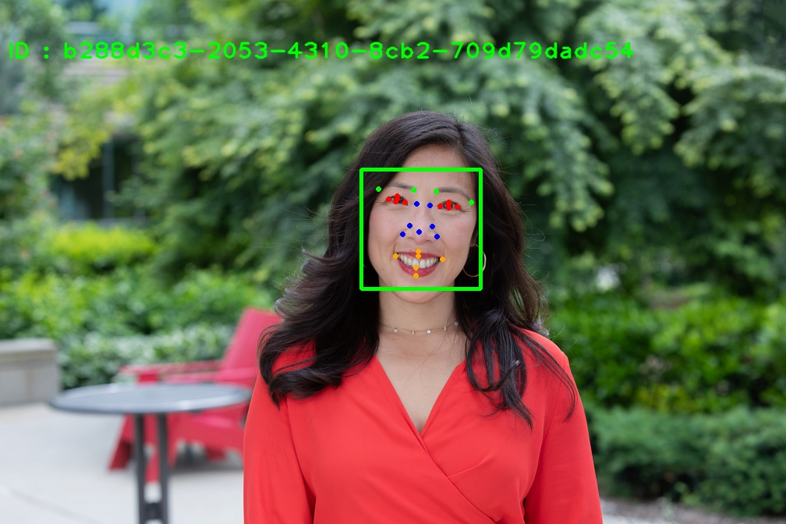
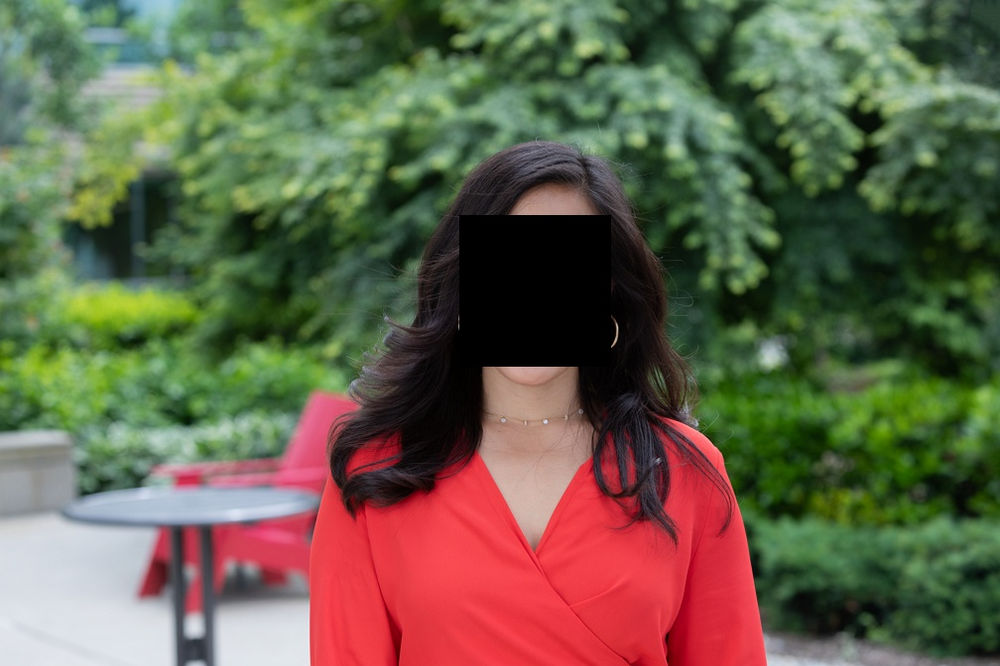

# Face Blurring with Azure Face API

The Azure Face service provides AI algorithms that detect, recognize, and analyze human faces in images. Facial recognition is important in many different scenarios, such as identity verification, touchless access control, and face blurring for privacy.

You can use Azure Face APU to blur any face from an image or a video.
You can blur the face or replace it by any other image or color.

Documentation:
https://docs.microsoft.com/en-us/azure/cognitive-services/face/

 
 
01-June-2021

Serge Retkowsky | serge.retkowsky@microsoft.com | https://www.linkedin.com/in/serger/

Note: All these Python notebooks were made for demo purposes. They were not designed for production usage. This feature is currently in public preview. This preview version is provided without a service-level agreement. Certain features might not be supported or might have constrained capabilities. For more information, see Supplemental Terms of Use for Microsoft Azure Previews. https://azure.microsoft.com/en-us/support/legal/preview-supplemental-terms/
